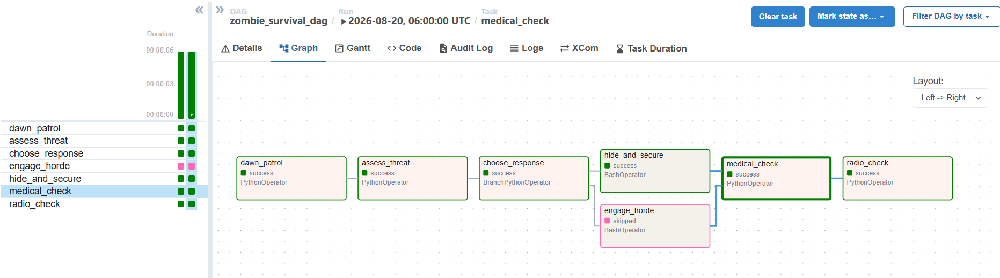
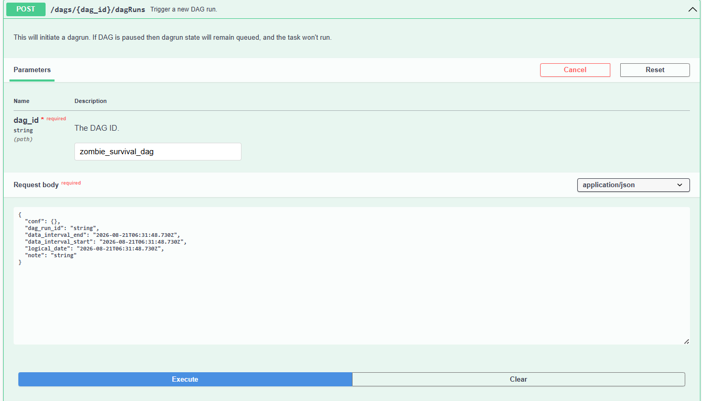
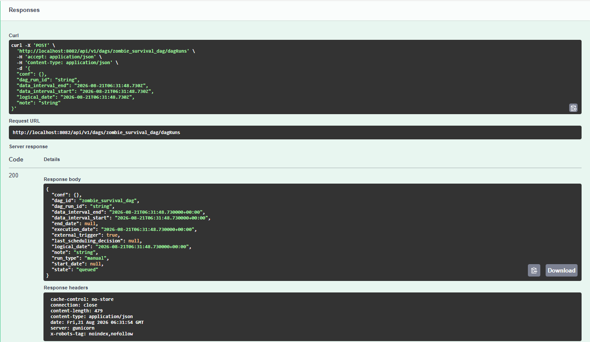
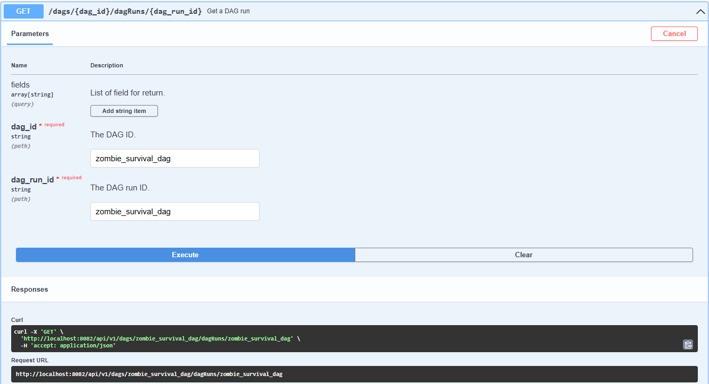
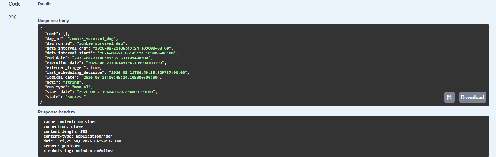
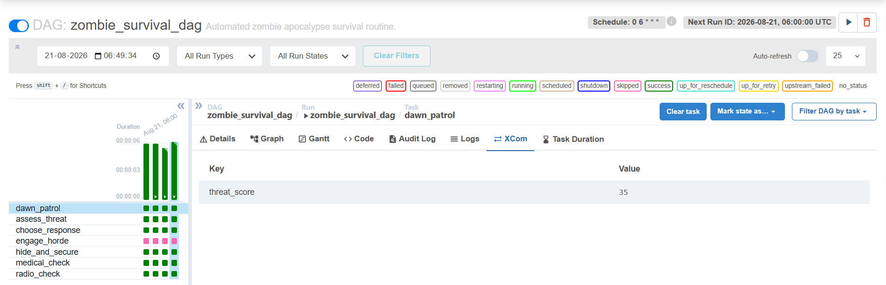
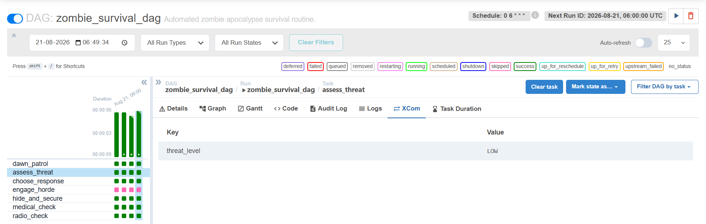
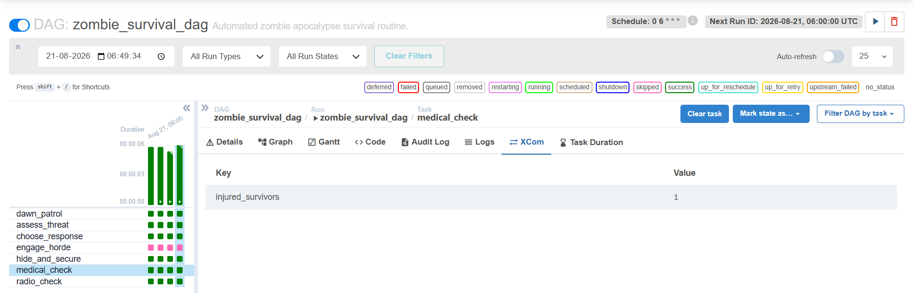

# Zombie Survival DAG

## Overview

The Zombie Survival DAG automates the daily survival routine
for a group of survivors living inside a bunker.

The workflow runs every morning at 06:00, when survivors perform a
perimeter patrol before beginning their daily activities. The pipeline
checks the threat level, decides the appropriate response, performs a
medical check, and finally sends a survival status report.

## Task Flow

The DAG contains seven tasks:

1. dawn_patrol
2. assess_threat
3. choose_response
4. engage_horde
5. hide_and_secure
6. medical_check
7. radio_check

The task flow is:

dawn_patrol -> assess_threat -> choose_response

From choose_response, the workflow branches into either:

- engage_horde for a HIGH threat
- hide_and_secure for a LOW or MEDIUM threat

The selected branch is executed while the unused branch is deliberately
skipped. Both branches then converge into medical_check, followed by
radio_check.

## XCom

XCom is used to pass runtime information between tasks.

The dawn_patrol task generates a simulated threat score between 0 and
100 and stores it in XCom using the key threat_score.

For example:

threat_score = 82

The assess_threat task retrieves the threat_score from XCom and
converts it into a threat level:

- 0-39: LOW
- 40-69: MEDIUM
- 70-100: HIGH

The resulting threat level is stored in XCom using the key
threat_level.

The choose_response task retrieves the threat_level from XCom and
uses it to determine whether the survivors should engage the horde or
hide and secure the bunker.

The medical_check task stores the number of injured survivors in XCom
using the key injured_survivors. The final radio_check task retrieves
the threat level and injury count to generate the survival status
report.

This allows information generated by earlier tasks to be reused by
later tasks during the same DAG run.

## Branching and Skipped Task

The choose_response task is implemented using BranchPythonOperator.

If the threat level is HIGH, the engage_horde task is executed and
the hide_and_secure task is skipped.

If the threat level is LOW or MEDIUM, the hide_and_secure task is
executed and the engage_horde task is skipped.

This represents a realistic survival decision where the bunker team
does not perform both actions simultaneously.

## Logging

All Python tasks use the Airflow task logger to record meaningful
execution details.

The logs include:

- Perimeter threat score
- Calculated threat level
- Selected survival response
- Reason for the unused branch being skipped
- Number of injured survivors
- Final survival status

Different logging levels such as INFO, WARNING, DEBUG, and CRITICAL
are used where appropriate.

## Schedule

The DAG runs at 06:00 every day using the cron expression:

0 6 * * *

Dawn is an appropriate time for the survival routine because the
survivors can assess overnight zombie activity before beginning their
daytime activities.

## API Trigger

The DAG was triggered manually using the Airflow REST API through the
Swagger UI rather than using the Airflow UI's "Trigger DAG" button.

The Airflow installation used for this assignment is Apache Airflow
2.9.3, so the REST API uses the /api/v1 endpoint.

The DAG was triggered using:

POST /api/v1/dags/{dag_id}/dagRuns

The API initially returned the DAG run with a queued state. After the
Airflow Scheduler completed the workflow, the DAG run was verified
using:

GET /api/v1/dags/{dag_id}/dagRuns/{dag_run_id}

The GET request returned the DAG run with:

state: success

This confirms that the DAG was successfully triggered through the
Airflow REST API and completed successfully.

## Screenshots

### 1. Airflow DAG Graph View



Shows the completed DAG run in Airflow Graph View. The screenshot
demonstrates the complete task flow and the unused branch visibly
marked as SKIPPED.

### 2. Swagger API Trigger Request and Response




Shows the Swagger POST request used to trigger zombie_survival_dag,
including the DAG run ID and request body, along with the API response
confirming that the DAG run was created.

### 3. Swagger DAG Run Success Response




Shows the Swagger GET request used to retrieve the triggered DAG run
and the response confirming:

dag_id: zombie_survival_dag

dag_run_id: zombie_survival_dag

state: success

This verifies that the DAG triggered through the REST API completed
successfully.


### 4. XCom - Dawn Patrol



Shows the threat_score value generated by the dawn_patrol task and
stored in Airflow XCom.

### 5. XCom - Threat Assessment



Shows the threat_level value generated by the assess_threat task and
stored in Airflow XCom.

### 6. XCom - Medical Check



Shows the injured_survivors value generated by the medical_check task
and stored in Airflow XCom.

## Submission Structure

The final submission contains:

```text
Shrinivas_airflow_assignment/
|
|-- dags/
|   |-- zombie_survival_dag.py
|
|-- README.md
|
|-- screenshots/
    |-- dag_graph_view.png
    |-- swagger_api_trigger_request.png
    |-- swagger_api_trigger_response.png
    |-- swagger_dag_run_success_request.png
    |-- swagger_dag_run_success_response.png
    |-- xcom_assess_threat.png
    |-- xcom_dawn_patrol.png
    |-- xcom_medical_check.png
```
