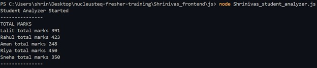
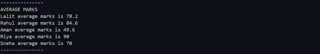
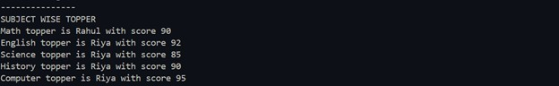
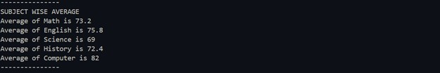
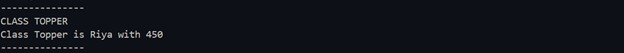
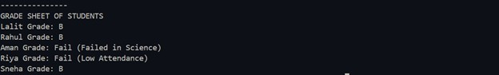

# Student Analyzer

This project is a **Student Analyzer** built using **JavaScript**. It calculates total marks, average marks, subject-wise toppers, subject averages, class topper, and grade sheets for students based on their scores and attendance.

---

## Features

1. Calculate **total marks** for each student.
2. Calculate **average marks** for each student.
3. Identify **subject-wise toppers**.
4. Calculate **average marks for each subject**.
5. Identify **class topper**.
6. Assign **grades** to students with additional fail conditions:
   - Any subject score ≤ 40 → Fail (with subject name)
   - Attendance < 75% → Fail (Low Attendance)

---

## Console Output Screenshots and Descriptions

### 1. Total Marks

  
**Description:** Shows the total marks of each student calculated by summing up marks from all subjects.

---

### 2. Average Marks

  
**Description:** Calculates average marks for each student by dividing total marks by number of subjects.

---

### 3. Subject-wise Toppers

  
**Description:** Shows the student with the highest score in each subject.

---

### 4. Subject-wise Average

  
**Description:** Calculates the average score for each subject across all students.

---

### 5. Class Topper

  
**Description:** Identifies the student with the highest total marks overall.

---

### 6. Grade Sheet of Students

  
**Description:** Assigns grades based on average marks and checks for fail conditions:

- Average ≥ 85 → A
- Average 70–84 → B
- Average 50–69 → C
- Average < 50 → Fail
- Overrides for attendance < 75 or subject score ≤ 40.

---

## How to Run

1. Open the terminal in your project directory.
2. Run the following command:

```bash
node Shrinivas_student_analyzer.js
```
