# 📦 Product Inventory Dashboard

A simple and fully functional **Product Inventory Management** web app built using pure **HTML, CSS, and JavaScript** — no frameworks or libraries used.

---

## 📌 Project Overview

This dashboard allows users to manage a product inventory directly in the browser. Users can add, delete, search, filter, and sort products. All data is saved using `localStorage` so it persists across page refreshes. The app also simulates an API call using `Promise` and `setTimeout()` to mimic real-world data loading behavior.

---

## 🚀 Features

- 🔍 **Search** products by name in real time (case-insensitive)
- 🗂️ **Filter** by category (Electronics, Clothing, Books, Accessories)
- 📉 **Low Stock Filter** — highlights products with stock less than 5
- 🔃 **Sort** by price (low→high, high→low) or name (A→Z, Z→A)
- ➕ **Add Product** with form validation
- 🗑️ **Delete Product** with instant UI and analytics update
- 📊 **Analytics Panel** — total products, total inventory value, out-of-stock count
- 💾 **LocalStorage** persistence — data survives page refresh
- ⏳ **Simulated API Loading** using `Promise` + `setTimeout()`
- 📄 **Pagination** — 6 products displayed per page

---

## 📸 Screenshots

### 1. Dashboard Overview

> The main view showing the header, analytics panel, and product grid loaded with default products.

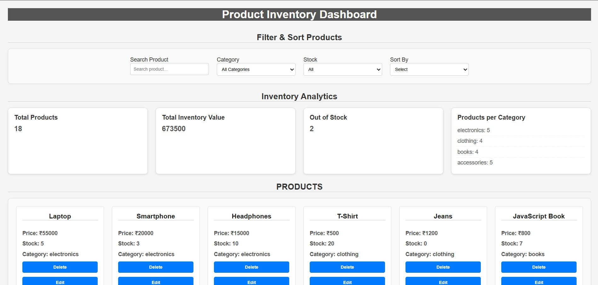

---

### 2. Product Grid

> Products rendered dynamically as cards showing name, category, price, stock, and action buttons.

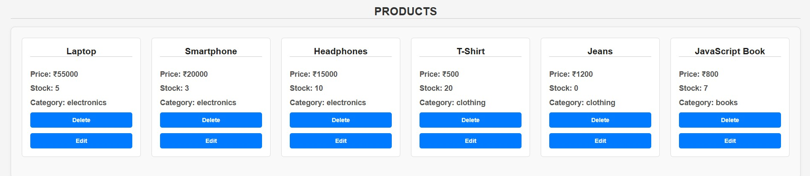

---

### 3. Analytics Panel

> Live inventory stats — total products, total inventory value (price × stock), and out-of-stock count.

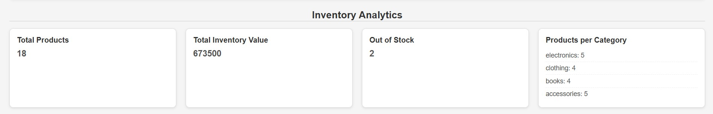

---

### 4. Search Feature

> Real-time search filters products as the user types. Here searching for "lap" which returns "Laptop".

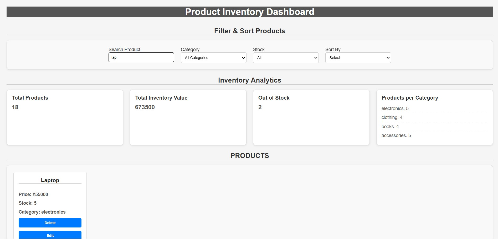

---

### 5. Category Filter

> Dropdown to filter products by a specific category. Here filtering by "Electronics".

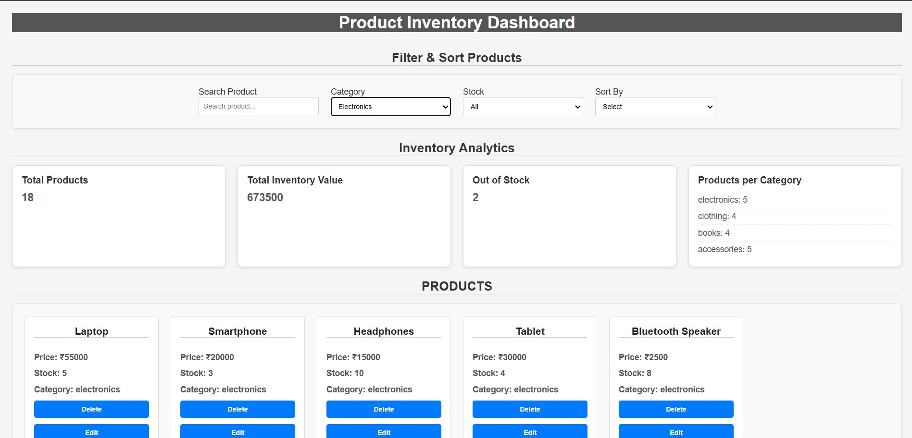

---

### 6. Low Stock Filter

> Filter showing only products where stock quantity is less than 5.

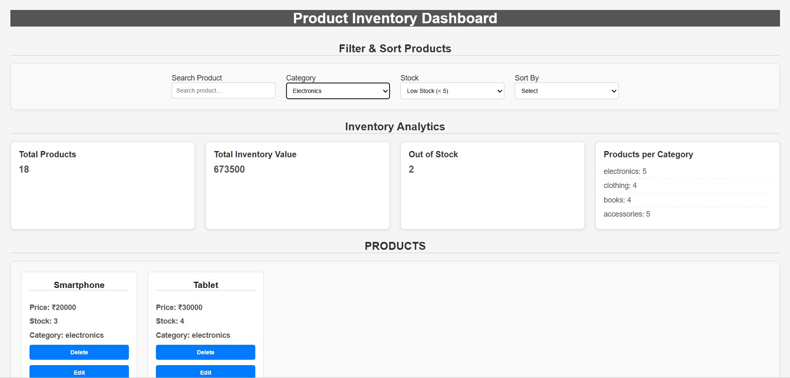

---

### 7. Sorting

> Products sorted by price from high to low using the sort dropdown.

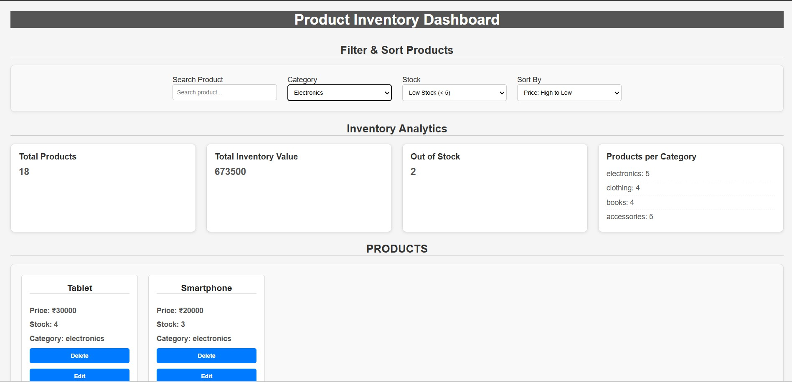

---

### 8. Add Product Form

> Form at the bottom of the page for adding a new product with name, price, stock, and category fields.

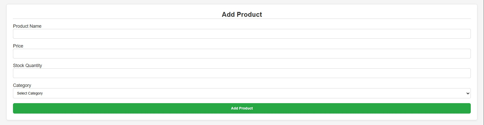

---

### 9. Edit Product

> Clicking Edit on a product card populates the form for updating the product details.

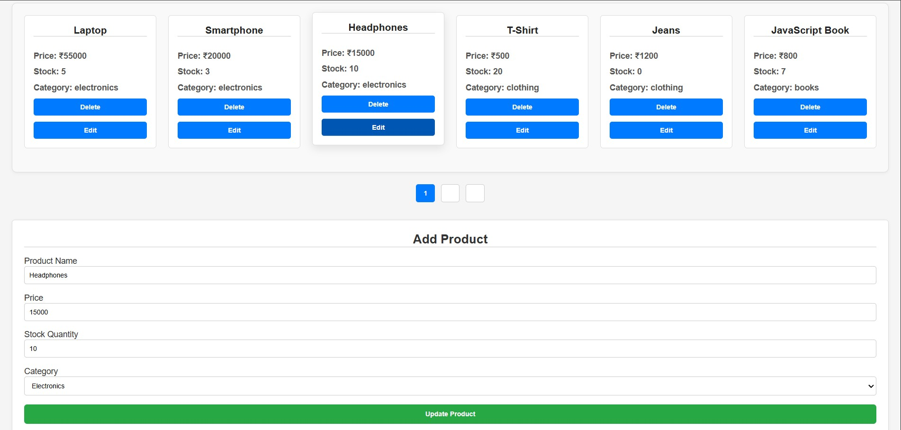

---

### 10. No Products Found

> A clear message is shown when no products match the current search or filter criteria.

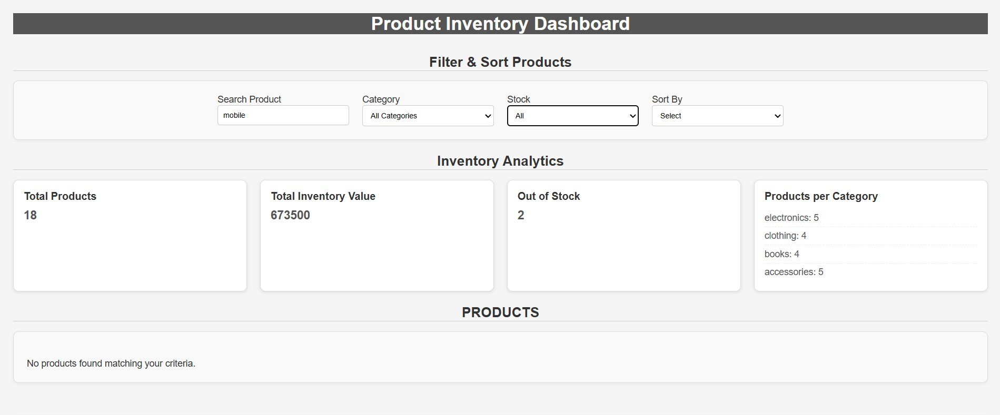

---

### 11. Pagination

> Products are split across pages with 6 per page. Active page is highlighted in blue.

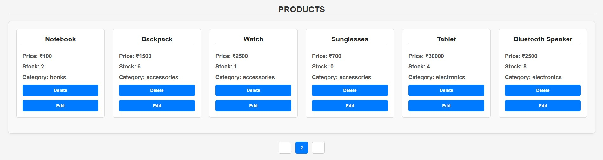

---

## 🗂️ Project Structure

```
product_inventory_dashboard/
├── index.html          # Main HTML structure
├── style.css           # All styles
├── script.js           # All JavaScript logic
├── screenshots/        # Screenshots for README
└── README.md
```

---

## ▶️ How to Run Locally

1. Clone the repository:

   ```bash
   git clone https://github.com/Shinu87/nucleusteq-fresher-training.git
   ```

2. Navigate to the project folder:

   ```bash
   cd Shrinivas_frontend/mini_app/product_inventory_dashboard
   ```

3. Open `index.html` in your browser:

   ```bash
   # macOS
   open index.html

   # Windows
   start index.html
   ```

> No installation or server setup needed. Just open and run.

---

## 🛠️ Built With

| Technology   | Purpose                         |
| ------------ | ------------------------------- |
| HTML5        | Page structure and layout       |
| CSS3         | Styling and responsive design   |
| JavaScript   | Logic, DOM manipulation, events |
| LocalStorage | Client-side data persistence    |

---

## 📦 Default Product Data

The app comes preloaded with 18 products across 4 categories:

- **Electronics** — Laptop, Smartphone, Headphones, Tablet, Bluetooth Speaker
- **Clothing** — T-Shirt, Jeans, Hoodie, Jacket
- **Books** — JavaScript Book, Python Book, DSA Book, Notebook
- **Accessories** — Backpack, Watch, Sunglasses, Wallet, Belt

If `localStorage` is empty (first load or after reset), these defaults are used automatically.

To reset to default data, run this in your browser console:

```javascript
localStorage.removeItem("products");
location.reload();
```

---

---

## 📄 License

This project was built for educational purposes as part of a frontend training assignment.
