# 🚆 Smart Railway Ops System

## 📌 Overview

This is a Spring Boot backend application that simulates a railway system.

It includes:

- Passenger Management APIs
- Notification System
- Dynamic Message Formatter

---

## 🧠 Concepts Used

- IoC (Inversion of Control)
- Dependency Injection (Constructor-based)
- Component Scanning
- Layered Architecture (Controller → Service → Repository)
- Exception Handling

---

# 🚀 APIs

---

## 👤 Passenger Management

### 🔹 Get All Passengers

**GET /users**

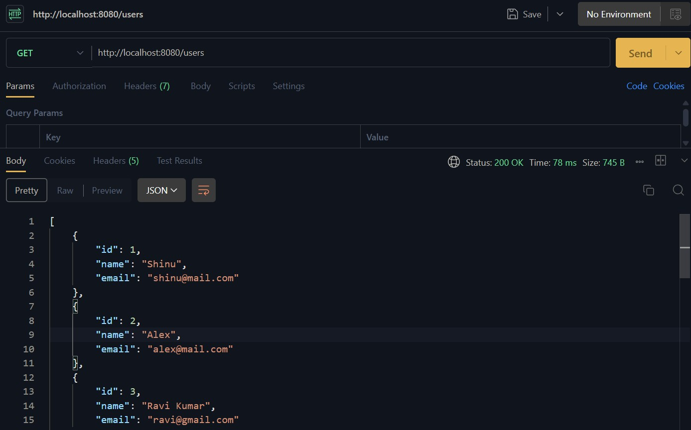

---

### 🔹 Get Passenger by ID

**GET /users/{id}**

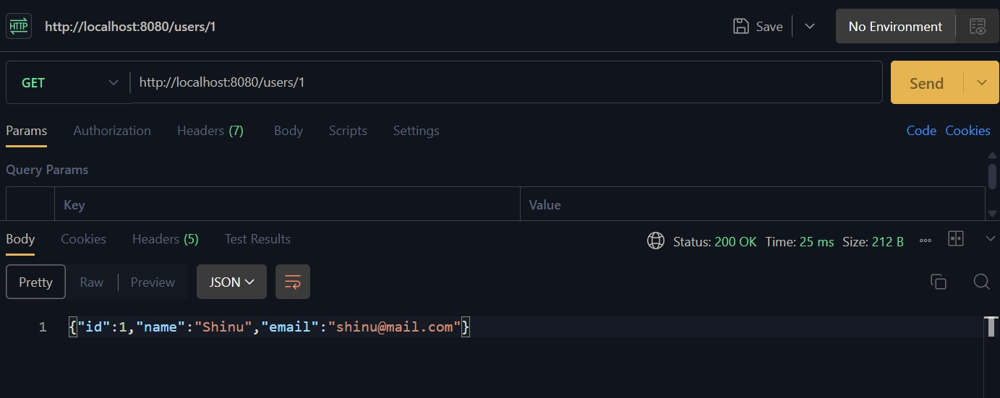

---

### 🔹 Passenger Not Found

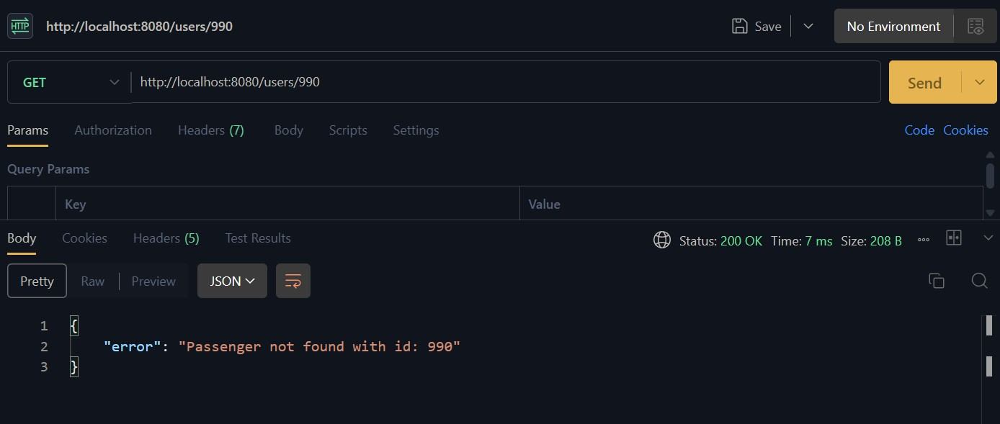

---

### 🔹 Create Passenger

**POST /users**

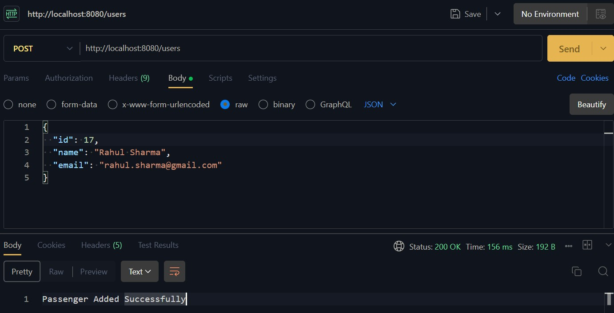

---

### 🔹 Duplicate Passenger Error

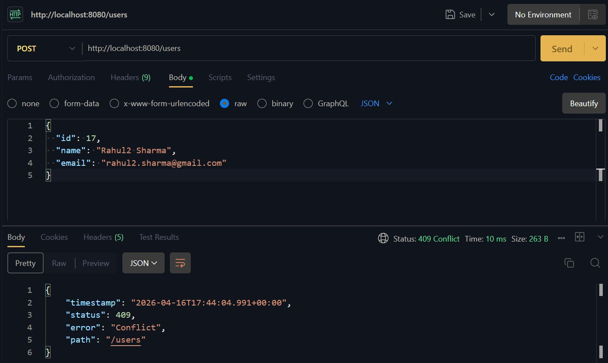

---

## 🔔 Notification System

### 🔹 Booking Notification

**POST /notify?eventType=BOOKING**

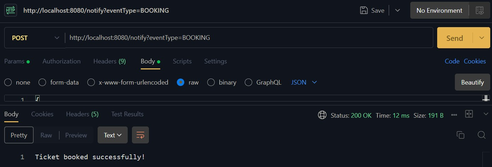

---

### 🔹 Cancellation Notification

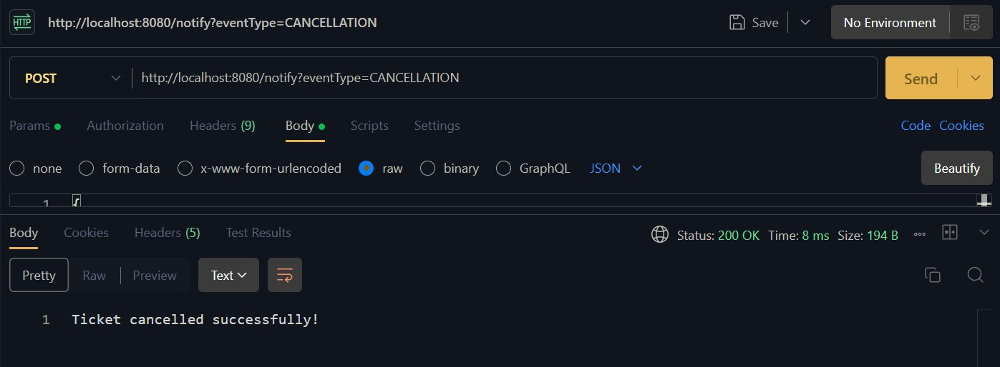

---

### 🔹 Default Notification

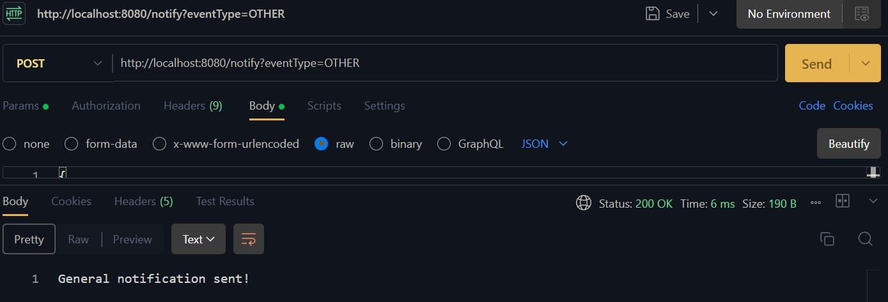

---

## 💬 Message Formatter

### 🔹 Short Message

**GET /message?type=SHORT**

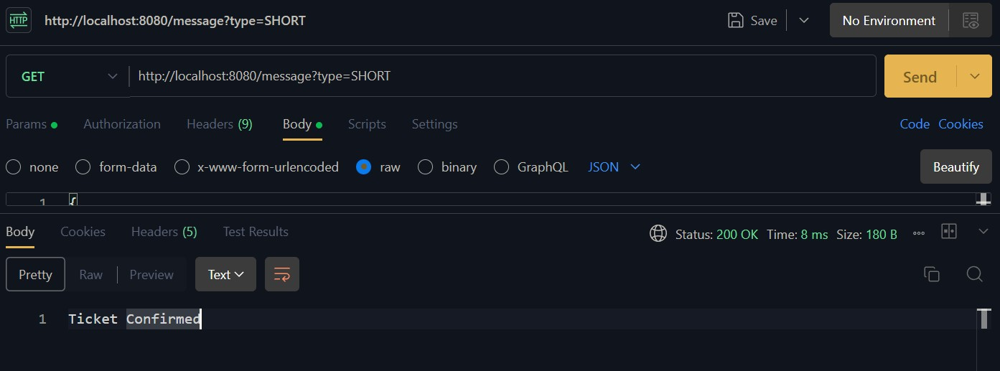

---

### 🔹 Long Message

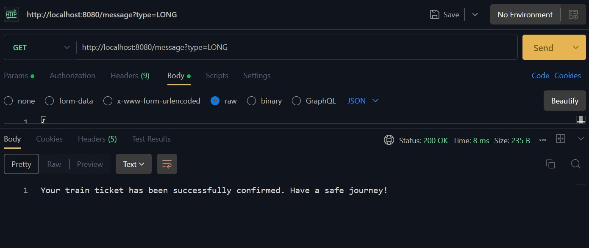

---

### 🔹 Invalid Type

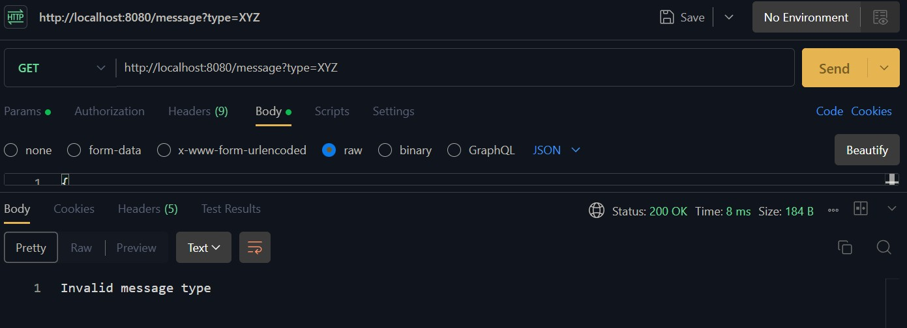
