# 🚀 Todo Application - Spring Boot

A simple REST API built using Spring Boot for Todo management.  
This project demonstrates CRUD operations, layered architecture, logging, and unit testing using Mockito.

---

# 📌 Tech Stack

- Java 17
- Spring Boot
- Spring Data JPA
- Maven
- H2 Database (In-memory)
- JUnit 5
- Mockito

---

# 📌 Features

- Create Todo
- Retrieve all Todos
- Retrieve Todo by ID
- Update Todo
- Delete Todo
- Status tracking (PENDING / COMPLETED)
- Service layer logging
- Unit testing with Mockito (Repository mocked)

---

# 📌 API Endpoints

## ➕ Create Todo

**POST** `/todos`

---

## 📋 Get All Todos

**GET** `/todos`

---

## 🔍 Get Todo by ID

**GET** `/todos/{id}`

---

## ✏️ Update Todo

**PUT** `/todos/{id}`

---

## ❌ Delete Todo

**DELETE** `/todos/{id}`

---

# 📸 API Execution Screenshots

## 1️⃣ Create Todo (Request)

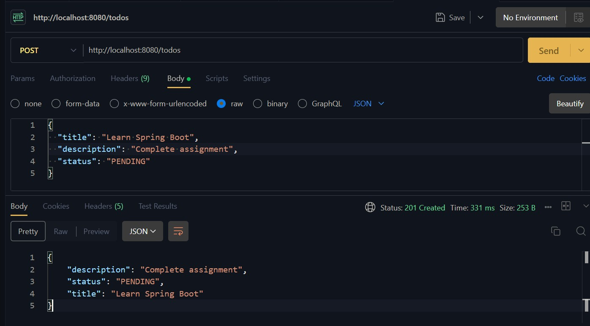

## 2️⃣ Create Todo (Logs)

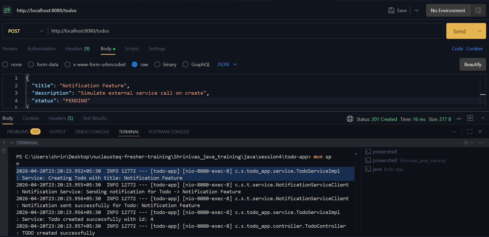

---

## 3️⃣ Get All Todos (Response)

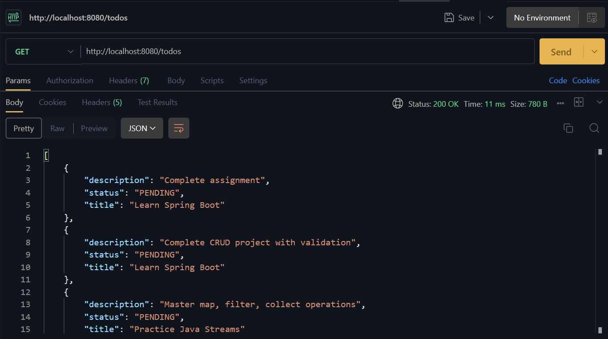

## 4️⃣ Get All Todos (Logs)

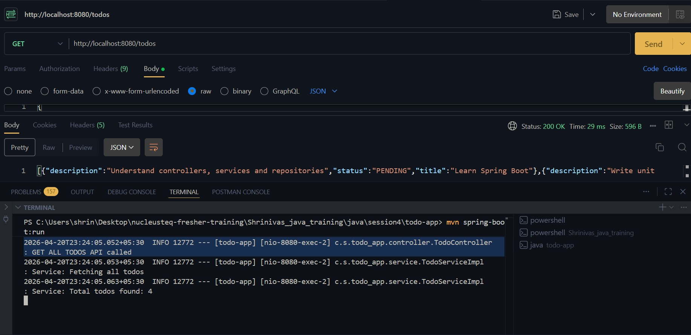

---

## 5️⃣ Get Todo by ID (Response)

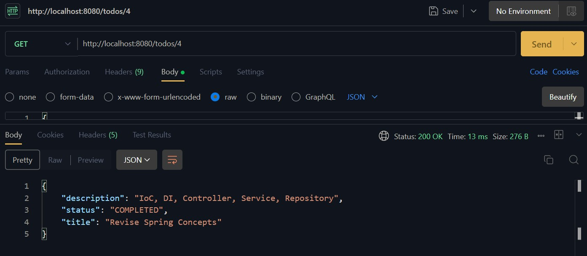

## 6️⃣ Get Todo by ID (Logs)

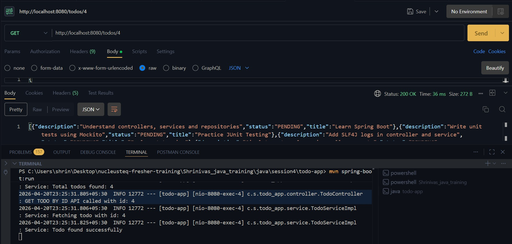

---

## 7️⃣ Update Todo (Before Update)

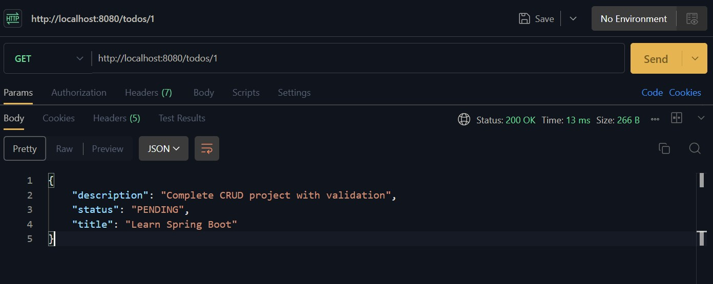

## 8️⃣ Update Todo (Logs)

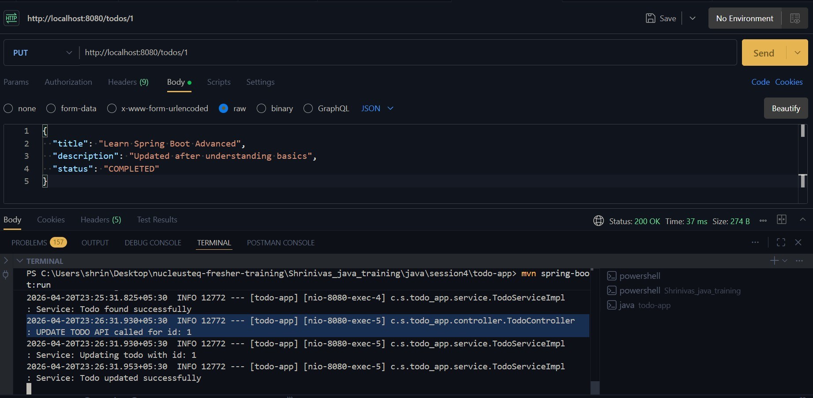

## 9️⃣ Update Todo (After Update)

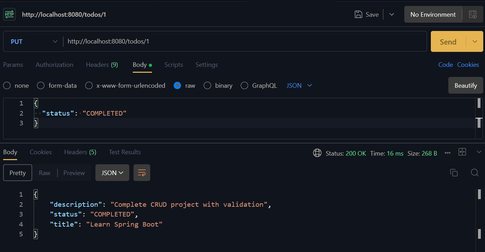

---

## 🔟 Delete Todo (Response)

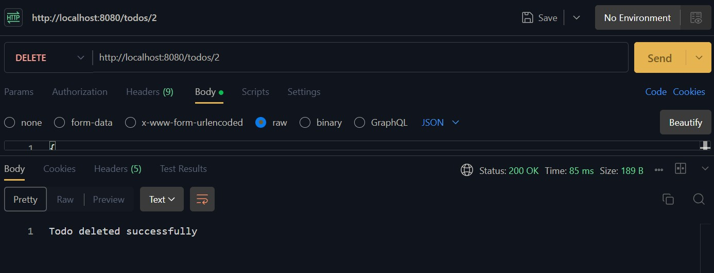

## 11️⃣ Delete Todo (Logs)

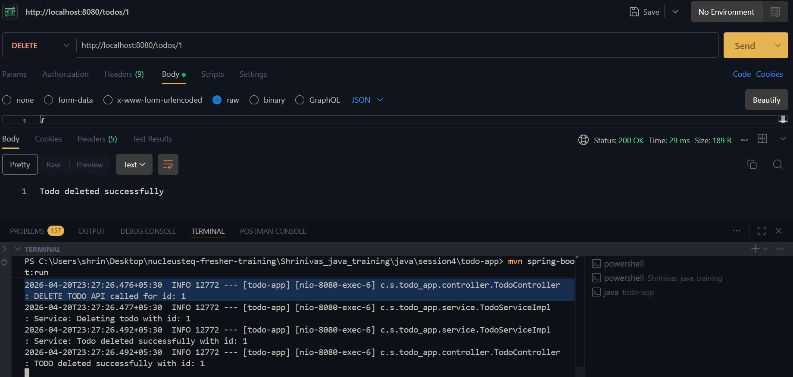

---

## 12️⃣ Error Case (Todo Not Found)

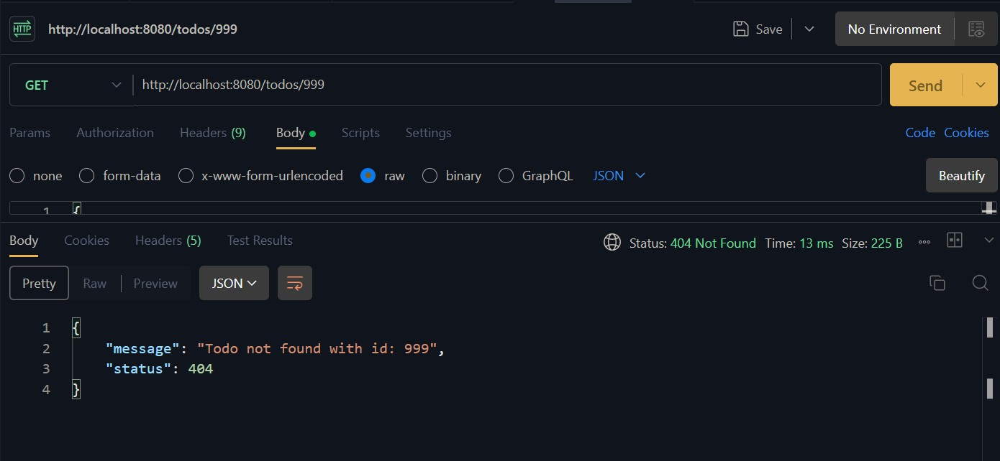

---

## 13️⃣ Unit Test Execution Logs

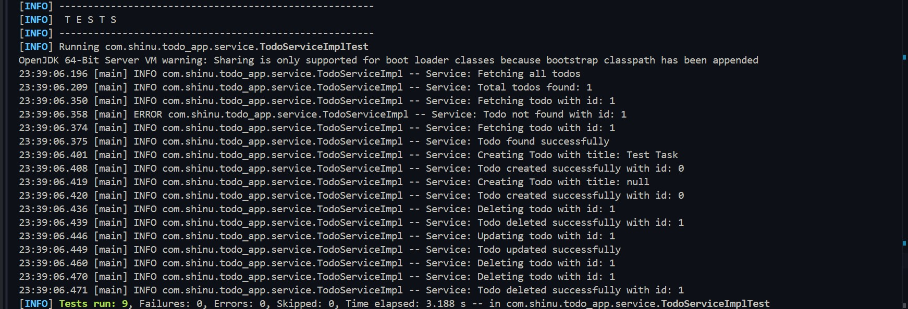

---

# 🧪 Running the Project

## ▶️ Run Application

```bash
mvn spring-boot:run
```
