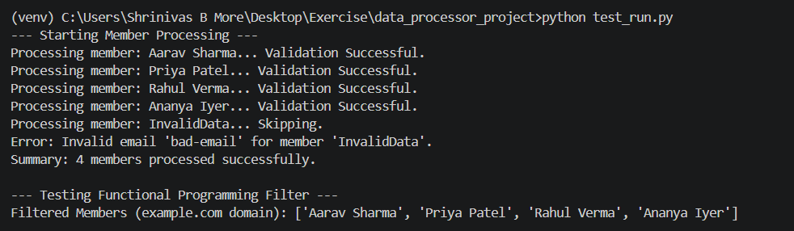

# Python Data Processor Task Package

Welcome to my Python Data Processor project! I built this modular Python package to handle user profile validation, text cleaning, and basic management using Object-Oriented Programming (OOP) and Regular Expressions (Regex).

This was developed as a task submission to practice structuring a clean, installable Python package with custom error handling.

---

## 📂 Project Structure

The project is structured as a standard modular Python package:

* **my_processor/**: The main package directory.
  * **__init__.py**: Makes the directory an importable package.
  * **core.py**: Main application logic containing OOP classes and managers.
  * **utils.py**: Helper logic handling Regex validation and data cleaning.
* **screenshots/**: Directory for project images.
  * **output.png**: Execution output screenshot.
* **README.md**: Project documentation.
* **setup.py**: Packaging and installation configuration file.
* **test_run.py**: Main entry point script to test the package.

---

## 🛠️ Installation & Setup

Since this project contains a setup configuration file, you can easily install it locally on your computer.

1. **Open your terminal** or command prompt.
2. **Navigate to the root directory** where the configuration file is located.
3. **Run the installer command** in editable mode so changes to your files apply immediately:
   ```bash
   pip install -e .
   ```

---

## 💻 Core Modules Explained

### 1. Utility Logic
This module handles raw input validation and text sanitization before the data gets converted into objects.
* **Custom Exceptions**: Implements a dedicated error to catch malformed data explicitly without crashing the app.
* **Regex Formats**: Uses regular expressions to strictly validate standard emails and standard 10-digit phone numbers.
* **Data Cleaning**: Trims blank spaces and ensures required fields exist and are valid before returning clean data.

### 2. Main Logic
This module implements the Object-Oriented structure of our application.
* **Member Class**: Represents an individual user profile with name, email, and phone attributes.
* **Member Manager Class**: Manages a collective list of profiles, processes batch lists, and tracks successful entries.
* **Error Isolation**: Utilizes safety blocks to isolate problematic rows so the application continues running smoothly through the entire dataset.
* **Functional Programming**: Features methods that demonstrate advanced Python concepts like filtering and mapping to pull out names matching specific email domains.

---

## 🚀 Running the Project

You can execute the testing script from your command line to see the validation and filtering features in action.

1. **Open your terminal** in the project root directory.
2. **Execute the script** using the standard Python command:
   ```bash
   python test_run.py
   ```

---

## 📊 Execution Output

When you run the script successfully, you will see step-by-step logs printing out each validation state and tracking failures. The terminal will display a clear summary of how many members processed successfully and show the final filtered domain lists. 

Here is the terminal output showing the successful execution of `test_run.py`:

